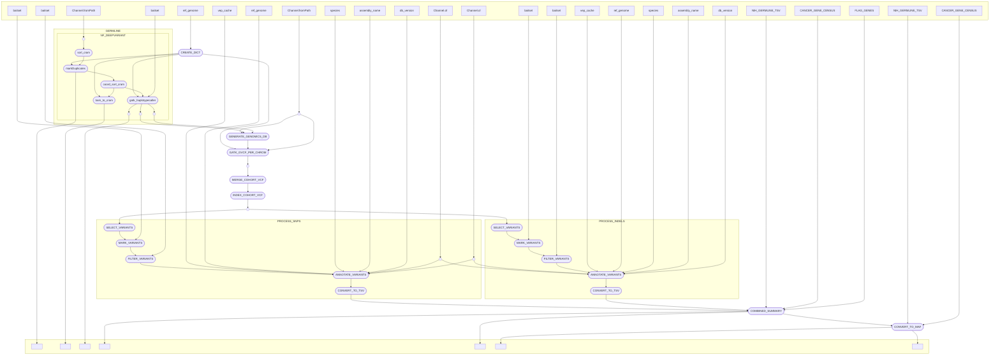

# dermatlas_germlinepost_nf

[](https://www.nextflow.io/)
[](https://www.docker.com/)
[](https://sylabs.io/docs/)

## Introduction

dermatlas_germlinepost_nf is a bioinformatics pipeline written in [Nextflow](http://www.nextflow.io) for generating and/or performing post-processing of germline variants generated with GATK on cohorts of tumors within the Dermatlas project. 

## Pipeline summary

In brief, the pipeline takes a set samples that have been pre-processed by the Dermatlas ingestion pipeline and then:
- Optional: Prepares samples for calling with GATK haplotype caller
- Generates a GenomicsDB datastore for joint calling germline variants
- Creates index files required by GATK for processing your genome of interest
- Generates per-chromosome variant call files for the cohort
- Merges those per-chrom files into a single cohort VCF and indexes it
- Selects, marks and filters SNPs and Indels as per GATK 
- Annotates the final variant sets with VEP
- Reformats and then summarises the data to produce germline oncoplots and tables.

## Inputs 

Inputs will depend on whether you are runnning in post-processing mode or end-to-end. Inputs can also be split into those which are cohort dependent and independent.

### Cohort-dependent variables
- `study_id`: prefix string to be applied to cohort-level summary files
- `outdir`: path to the where you would like the pipeline to output results
- `post_process_only`: logical determining whether to run post processing (VCF-> oncoplot) or the end-to-end (BAM -> oncoplot) germline analysis. 

**If true, the following inputs are required:**
- `geno_vcf`: a path to a set of .vcf files in a project directory. **Note: the pipeline assumes that corresponding index files have been pre-generated and are co-located with vcf and you should use a ** glob match to recursively collect all bamfiles in the directory**
- `sample_map`: path to a tab delimited file containing Sample IDs and the vcf files that they correspond to. Please see `tests/testdata/sample_map.tsv` for an example

**If false, the following inputs are required:**
- `tsv_file`: a manifest containing sample ids, associated bam files and their indexes. Please see `tests/testdata/manifest.tsv` for an example


### Cohort-independent variables
Reference files that are reused across pipeline executions have been placed within the pipeline's default `nextflow.config` file to simplify configuration. These can be ommited from setup. Behind the scences though, the following reference files are required for a run: 
- `chrom_list`: path to a text file containing ordered chrosome names See `assets/grch38_chromosome.txt`
- `reference_genome`: path to a reference genome file
- `baitset`: path to a `.bed` file describing the analysed genomic regions
- `vep_cache`: path to the release directory that contains a vep cache 
- `custom_files`: path to a set of annotation file to use in VEP (seperated by semi-colons)
- `custom_args`: path to a set of arguments to use with each custom file in VEP (seperated by semi-colons)
- `species`: VEP parameter, specifying the species being analysed (string)
- `db_name`: VEP parameter, specifying the ensembl data package version and corresponding db
- `assembly`: VEP parameter, specifying the reference genome build for the run.
- `summarise_results`: logical (whether to apply Dermatlas post processing into tables and figure)
**If true, the following inputs are required:**
- `nih_germline_resource`: path to file containing the information of the set of genes used by the NHS for [germline cancer predisposition diagnosis - prepared by mdc1@sanger.ac.uk](https://gitlab.internal.sanger.ac.uk/DERMATLAS/resources/national_genomic_test_germline_cancer_genes/-/tree/0.1.0?ref_type=tags)
- `cancer_gene_census_resoruce`: Cancer gene Census list of genes form COSMIC v97 
- `flag_genes`: path to a list of [FLAG](https://bmcmedgenomics.biomedcentral.com/articles/10.1186/s12920-014-0064-y#Sec11) genes, frequently mutated in normal exomes.
- `publish_intermediates`: logical (whether to publish large intermediate files (BAM and CRAMs)to the output directory)
- `alternative_transcripts`: path to a file containing Ensembl transcripts where we wish to modify the canonical transcript for accurate variant reporting.


Default values for reference files are supplied within the `nextflow.config` file and can be overided by adding them to the params `.json` file. An example complete params file `tests/test_data/test_params.json` is supplied within this repository for demonstation.

## Usage 

The recommended way to launch this pipeline on Sangers HPC is using a wrapper script (e.g. `bsub < my_wrapper.sh`) that submits nextflow as a job and records the version (**e.g.** `-r 0.1.1`)  and the `.json` parameter file supplied for a run.

An example wrapper script:
```
#!/bin/bash
#BSUB -q oversubscribed
#BSUB -G team113-grp
#BSUB -R "select[mem>8000] rusage[mem=8000] span[hosts=1]"
#BSUB -M 8000
#BSUB -oo logs/germline_variant_calling_%J.o
#BSUB -eo logs/germline_variant_calling_%J.e

PARAMS_FILE="/lustre/scratch125/casm/team113da/users/jb63/nf_germline_testing/params.json"

# Load module dependencies
module load nextflow-23.10.0
module load /software/modules/ISG/singularity/3.11.4

# Create a nextflow job that will spawn other jobs

nextflow run 'https://gitlab.internal.sanger.ac.uk/DERMATLAS/analysis-methods/dermatlas_germlinepost_nf' \
-r 0.3.0 \
-params-file $PARAMS_FILE \
-profile farm22 
```

When running the pipeline for the first time on the farm you will need to provide credentials to pull singularity containers from the team113 sanger gitlab. You should be able to do this by running
```
module load singularity/3.11.4 
singularity remote login --username $(whoami) docker://gitlab-registry.internal.sanger.ac.uk
```

The pipeline can configured to run on either Sanger OpenStack secure-lustre instances or farm22 by changing the profile speicified:
`-profile secure_lustre` or `-profile farm22`. 

## Pipeline visualisation 
Created using nextflow's in-built visualitation features.



## Testing

This pipeline has been developed with the [nf-test](http://nf-test.com) testing framework. Unit tests and small test data are provided within the pipeline `test` subdirectory. A snapshot has been taken of the outputs of most steps in the pipeline to help detect regressions when editing. You can run all tests on openstack with:

```
nf-test test 
```
and individual tests with:
```
nf-test test tests/modules/ascat_exomes.nf.test
```

For faster testing of the flow of data through the pipeline **without running any of the tools involved**, stubs have been provided to mock the results of each succesful step.
```
nextflow run main.nf \
-params-file params.json \
-c tests/nextflow.config \
--stub-run
```


