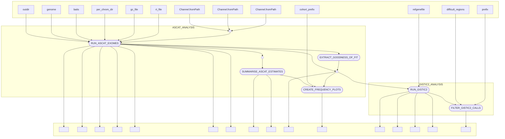

# dermatlas_germlinepost_nf

[](https://www.nextflow.io/)
[](https://www.docker.com/)
[](https://sylabs.io/docs/)

## Introduction

dermatlas_germlinepost_nf is a bioinformatics pipeline written in [Nextflow](http://www.nextflow.io) for performing post-processing of germline variants generated with GATK  oncohorts of tumors within the Dermatlas project. 

## Pipeline summary

In brief, the pipeline takes a set samples that have been pre-processed by the Dermatlas ingestion pipeline and then:
- 

## Inputs 

### Cohort-dependent variables

### Cohort-independent variables
Reference files that are reused across pipeline executions have been placed within the pipeline's default `nextflow.config` file to simplify configuration and can be ommited from setup. Behind the scences though, the following reference files are required for a run: 
- `reference_genome`: path to a reference genome file (ASCAT).
- `bait_set`: path to a `.bed` file describing the analysed genomic regions  (ASCAT).

Default reference file values supplied within the `nextflow.config` file can be overided by adding them to the params `.json` file. An example complete params file `example_params.json` is supplied within this repo for demonstation.

## Usage 

The recommended way to launch this pipeline is using a wrapper script (e.g. `bsub < my_wrapper.sh`) that submits nextflow as a job and records the version (**e.g.** `-r 0.4.0`)  and the `.json` parameter file supplied for a run.

An example wrapper script:
```
#!/bin/bash
#BSUB -q normal
#BSUB -G team113
#BSUB -R "select[mem>8000] rusage[mem=8000] span[hosts=1]"
#BSUB -M 8000
#BSUB -oo nf_out.o
#BSUB -eo nf_out.e

PARAMS_FILE="/lustre/scratch125/casm/team113da/users/jb63/nf_cna_testing/params.json"

# Load module dependencies
module load nextflow-23.10.0
module load /software/modules/ISG/singularity/3.11.4
module load /software/team113/modules/modulefiles/tw/0.6.2

# Create a nextflow job that will spawn other jobs

nextflow run 'https://gitlab.internal.sanger.ac.uk/DERMATLAS/analysis-methods/dermatlas_germlinepost_nf' \
-r 0.1.0 \
-params-file $PARAMS_FILE \
-c nextflow.config \
-profile farm22 
```


When running the pipeline for the first time on the farm you will need to provide credentials to pull singularity containers from the team113 sanger gitlab. These should be provided as environment variables:
`SINGULARITY_DOCKER_USERNAME`=userid@sanger.ac.uk
`SINGULARITY_DOCKER_PASSWORD`=YOUR_GITLAB_LOGIN_PASSWORD

You can fix these variables to load by default by adding the following lines to your `~/.bashrc` file
```
export SINGULARITY_DOCKER_USERNAME=userid@sanger.ac.uk
export SINGULARITY_DOCKER_PASSWORD=YOUR_GITLAB_LOGIN_PASSWORD
```

The pipeline can configured to run on either Sanger OpenStack secure-lustre instances or farm22 by changing the profile speicified:
`-profile secure_lustre` or `-profile farm22`. 

## Pipeline visualisation 
Created using nextflow's in-built visualitation features.



## Testing

This pipeline has been developed with the [nf-test](http://nf-test.com) testing framework. Unit tests and small test data are provided within the pipeline `test` subdirectory. A snapshot has been taken of the outputs of most steps in the pipeline to help detect regressions when editing. You can run all tests on openstack with:

```
nf-test test 
```
and individual tests with:
```
nf-test test tests/modules/ascat_exomes.nf.test
```

For faster testing of the flow of data through the pipeline **without running any of the tools involved**, stubs have been provided to mock the results of each succesful step.
```
nextflow run main.nf \
-params-file params.json \
-c tests/nextflow.config \
--stub-run
```


