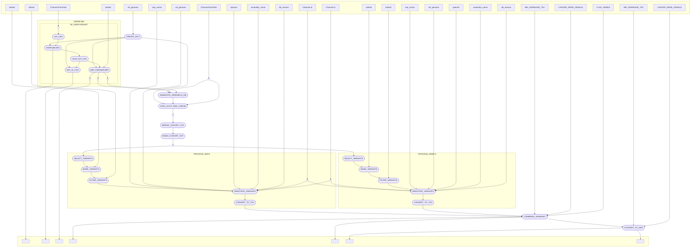

# dermatlas_germlinepost_nf

[](https://www.nextflow.io/)
[](https://www.docker.com/)
[](https://sylabs.io/docs/)

## Introduction

dermatlas_germlinepost_nf is a bioinformatics pipeline written in [Nextflow](http://www.nextflow.io) for generating and/or performing post-processing of germline variants generated with GATK on cohorts of tumors within the Dermatlas project. 

## Pipeline summary

In brief, the pipeline takes a set samples that have been pre-processed by the Dermatlas ingestion pipeline and then:
- Optional: Prepares samples for calling with GATK haplotype caller
- Generates a GenomicsDB datastore for joint calling germline variants
- Creates index files required by GATK for processing your genome of interest
- Generates per-chromosome variant call files for the cohort
- Merges those per-chrom files into a single cohort VCF and indexes it
- Selects, marks and filters SNPs and Indels as per GATK 
- Annotates the final variant sets with VEP
- Reformats and then summarises the data to produce germline oncoplots and tables.

## Inputs 

Inputs will depend on whether you are runnning in post-processing mode or end-to-end. Inputs can also be split into those which are cohort dependent and independent.

### Cohort-dependent variables
- `study_id`: prefix string to be applied to cohort-level summary files
- `outdir`: path to the where you would like the pipeline to output results
- `post_process_only`: logical determining whether to run post processing (VCF-> oncoplot) or the end-to-end (BAM -> oncoplot) germline analysis. 

**If true, the following inputs are required:**
- `geno_vcf`: a path to a set of .vcf files in a project directory. **Note: the pipeline assumes that corresponding index files have been pre-generated and are co-located with vcf and you should use a ** glob match to recursively collect all bamfiles in the directory**
- `sample_map`: path to a tab delimited file containing Sample IDs and the vcf files that they correspond to. Please see `tests/testdata/sample_map.tsv` for an example

**If false, the following inputs are required:**
- `tsv_file`: a manifest containing sample ids, associated bam files and their indexes (header `sample`, `object`, `object_index`). Please see `tests/testdata/manifest.tsv` for an example. In managed runs dermanager generates it and exports its path as `DNA_GERMLINE_NORMAL_MANIFEST`, which `assets/germline_variants.config` reads.


### Cohort-independent variables
Reference files that are reused across pipeline executions have been placed within the pipeline's default `nextflow.config` file to simplify configuration. These can be ommited from setup. Behind the scences though, the following reference files are required for a run: 
- `chrom_list`: path to a text file containing ordered chrosome names See `assets/grch38_chromosome.txt`
- `reference_genome`: path to a reference genome file
- `baitset`: path to a `.bed` file describing the analysed genomic regions
- `vep_cache`: path to the release directory that contains a vep cache 
- `custom_files`: path to a set of annotation file to use in VEP (seperated by semi-colons)
- `custom_args`: path to a set of arguments to use with each custom file in VEP (seperated by semi-colons)
- `species`: VEP parameter, specifying the species being analysed (string)
- `db_version`: VEP parameter, specifying the ensembl data package version and corresponding db
- `assembly`: VEP parameter, specifying the reference genome build for the run.
- `summarise_results`: logical (whether to apply Dermatlas post processing into tables and figure)
**If true, the following inputs are required:**
- `nih_germline_resource`: path to file containing the information of the set of genes used by the NHS for [germline cancer predisposition diagnosis - prepared by mdc1@sanger.ac.uk](https://gitlab.internal.sanger.ac.uk/DERMATLAS/resources/national_genomic_test_germline_cancer_genes/-/tree/0.1.0?ref_type=tags)
- `cancer_gene_census_resoruce`: Cancer gene Census list of genes form COSMIC v97 
- `flag_genes`: path to a list of [FLAG](https://bmcmedgenomics.biomedcentral.com/articles/10.1186/s12920-014-0064-y#Sec11) genes, frequently mutated in normal exomes.
- `publish_intermediates`: logical (whether to publish large intermediate files (BAM and CRAMs)to the output directory)
- `alternative_transcripts`: path to a file containing Ensembl transcripts where we wish to modify the canonical transcript for accurate variant reporting.


Default values for reference files are supplied within the `nextflow.config` file and can be overided by adding them to the params `.json` file. An example complete params file `tests/test_data/test_params.json` is supplied within this repository for demonstation.

## Usage

Whether launched via the integrated website or manually, the pipeline is submitted the same way: `run_germline.sh` is piped into `bsub` as the
job script.

```bash
bsub -o "<stdout_log>" -e "<stderr_log>" \
     -g "<lsf_job_group>" -J "<job_name>" \
     < <dir>/run_germline.sh
```

Queue, resource group and memory come from the `#BSUB` directives inside the wrapper, so `bsub` adds only the job
name, job group and log paths. It is an ordinary bash script, so `bash run_germline.sh` also runs it in the
foreground on any farm node - the `#BSUB` lines are inert comments; `bsub` only makes it a batch job. Either way
it sources `./source_me.sh` relative to the directory it was started from.

Nearly all runs are triggered from the [Dermatlas cohorts page](https://team113.sanger.ac.uk/dermatlas/cohorts/),
which issues that command remotely against a project directory it has already provisioned - `source_me.sh`,
`run_germline.sh` and `germline_variants.config` are all written for you, and so is the normal manifest
(`DNA_GERMLINE_NORMAL_MANIFEST`) the pipeline reads. There is nothing to do by hand.

When running the pipeline for the first time on the farm you will need to provide credentials to pull singularity
containers from the team113 sanger gitlab registry:

```bash
module load singularity/3.11.4
singularity remote login --username $(whoami) docker://gitlab-registry.internal.sanger.ac.uk
```

### Without the website

Clone the repo and supply what the website otherwise provisions: a project directory, the pipeline's
environment, and a couple of edits to the wrapper.

The one input with a required shape is the normal manifest: a tab-separated file with a header and the columns
`sample`, `object` (the BAM) and `object_index` (its index), one matched normal per patient - see
[Inputs](#cohort-dependent-variables) and `tests/testdata/manifest.tsv`.

```
<project_dir>/                                   # PROJECT_DIR
├── metadata/
│   └── normal_manifest.tsv                      # DNA_GERMLINE_NORMAL_MANIFEST
├── analysis/                                    # ANALYSIS_DIR; results land in analysis/germline
└── germline_pipe/                               # created by the wrapper, not by you
    ├── .lock                                    # see Reclaiming disk space
    ├── .completed_successfully                  #   "
    ├── work/                                    # deleted after a successful run
    └── tmp/
```

The environment itself can come from a `source_me.sh` or from the wrapper directly. Both are supported; pick one.

<details>
<summary><strong>With a <code>source_me.sh</code></strong> - reusable across runs, and the shape the website generates</summary>

1. Write `source_me.sh` beside the wrapper in `assets/`, which is where the wrapper looks by default. With
   reporting opted out, these six exports are the whole contract:

   ```bash
   export PROJECT_DIR="/lustre/.../6740_3016_MY_COHORT_WES"
   export COMMANDS_DIR="${PROJECT_DIR}/commands"
   export ANALYSIS_DIR="${PROJECT_DIR}/analysis"
   export STUDY="6740"     # prefixes output filenames, and the run id
   export PROJECT="3016"   # part of the run id
   export DNA_GERMLINE_NORMAL_MANIFEST="${PROJECT_DIR}/metadata/normal_manifest.tsv"  # tsv_file
   ```

2. In the wrapper, under **OPT-IN REPORTING** set `DERMATLAS_WEBSITE_LOGGING` and
   `DERMATLAS_SLACK_NOTIFICATIONS` to `"false"`, and under **RUN CONFIGURATION** point `CONFIG` at your
   `germline_variants.config` and set `REVISION` to the release tag to run.

3. Submit from the directory holding `source_me.sh`:

   ```bash
   cd dermatlas_germlinepost_nf/assets
   bsub -o run.out -e run.err -J "germline-<cohort>" < run_germline.sh
   ```

To override a single value without regenerating the file, uncomment just that variable in the wrapper's
**MANUAL ENVIRONMENT OVERRIDES** block - it is read after `source_me.sh`, so it wins.

</details>

<details>
<summary><strong>By editing <code>run_germline.sh</code> directly</strong> - self-contained, nothing to track outside the script</summary>

1. Under **ENVIRONMENT SETUP**, set `SOURCE_ME="none"` so the wrapper skips sourcing anything.

2. Under **MANUAL ENVIRONMENT OVERRIDES**, uncomment and fill in the pipeline-essential exports. With reporting
   opted out, these six are the whole contract:

   ```bash
   export PROJECT_DIR="/lustre/.../6740_3016_MY_COHORT_WES"
   export COMMANDS_DIR="${PROJECT_DIR}/commands"
   export ANALYSIS_DIR="${PROJECT_DIR}/analysis"
   export STUDY="6740"     # prefixes output filenames, and the run id
   export PROJECT="3016"   # part of the run id
   export DNA_GERMLINE_NORMAL_MANIFEST="${PROJECT_DIR}/metadata/normal_manifest.tsv"  # tsv_file
   ```

3. Under **OPT-IN REPORTING** set `DERMATLAS_WEBSITE_LOGGING` and `DERMATLAS_SLACK_NOTIFICATIONS` to
   `"false"`, and under **RUN CONFIGURATION** point `CONFIG` at your `germline_variants.config` and set `REVISION`
   to the release tag to run.

4. Submit from anywhere - with `SOURCE_ME="none"` there is no `source_me.sh` to be beside:

   ```bash
   bsub -o run.out -e run.err -J "germline-<cohort>" < dermatlas_germlinepost_nf/assets/run_germline.sh
   ```

The same block is the annotated master list for either route - every variable with its purpose and an example
value, including the website- and Slack-only ones you would add if you opted back in.

</details>

`germline_variants.config` reads these same variables, so it needs no editing unless you want to change which
steps run or rerun from VCFs (`post_process_only`). `REVISION` is fetched from GitHub, so your clone supplies
the wrapper and config, not the pipeline code - local edits to the workflow are not picked up until released.

The header of [`assets/run_germline.sh`](assets/run_germline.sh) maps every section and marks the
`[edit]` blocks, which are the only places you should need to touch.

On a successful run the wrapper also makes `${ANALYSIS_DIR}/germline` group read-writable
(`chmod -R ug+rw`), so the results can be revised by the rest of the team.

The pipeline can also be run directly with `nextflow run` on either Sanger OpenStack secure-lustre instances or
farm22 by changing the profile specified: `-profile secure_lustre` or `-profile farm22`.

### Toggles

| Variable | Default | Effect when `false` |
| --- | --- | --- |
| `DERMATLAS_WEBSITE_LOGGING` | `true` | no analysis-log record is written to the Dermatlas website |
| `DERMATLAS_SLACK_NOTIFICATIONS` | `true` | no Slack message on completion or failed launch |
| `DERMATLAS_CLEANUP_WORK_DIR` | `true` | this run's work directory is kept instead of deleted |

Work-directory cleanup only ever happens after a **successful** run; a failed one always keeps its work
directory, and so does one stopped by `bkill` or an LSF limit - `DERMATLAS_CLEANUP_WORK_DIR` is not consulted
unless the run succeeded. Cleanup relies on `params.publish_dir_mode = 'copy'`, and only ever removes the `work/` directory
the wrapper itself created. A cleaned-up run cannot be `-resume`d: to rerun only the post-processing, use
`post_process_only = true` against the published haplotypecaller VCFs (see the user docs).

None are required. Each is resolved from the environment, most specific first - a shell export beats
`source_me.sh`, which beats the default under **OPT-IN REPORTING** - so a single run can opt out without
editing anything:

```bash
export DERMATLAS_CLEANUP_WORK_DIR=false
bsub -o run.out -e run.err -J "germline-<cohort>" < run_germline.sh
```

`true/false`, `yes/no`, `on/off` and `1/0` are all accepted in any case; anything else fails the launch
immediately rather than part-way through.

### Reclaiming disk space

`work/` and `tmp/` are the bulk of a cohort's disk and inode use, and are usually deleted by a separate clean-up
script you run yourself rather than by the wrapper. So the wrapper leaves three dot-files in
`${PROJECT_DIR}/<pipeline_slug>/` that let such a script tell a live run from a finished one - **including a run
started by a different user, with no LSF tools involved**.

<details>
<summary><strong>The artefacts, and how to delete safely around them</strong></summary>

| Artefact | Meaning |
| --- | --- |
| `.lock` | created once and **never removed**. Its presence says only that this directory uses the scheme. It never means a run is live. |
| `.completed_successfully` | the last run finished successfully |
| `.completed_with_error` | the last run reached a conclusion and failed - `bkill` and LSF limit kills included |

Liveness is not a file. It is an exclusive `flock` held on `.lock` for as long as the wrapper owns the directory,
and the kernel releases it when the process dies by any means, including `kill -9` and a node crash. So there is
never a stale lock to clear - and `.lock` must never be deleted, because unlinking it lets the next run lock a
fresh inode and exclude nobody.

Both sentinels are cleared when a run starts and exactly one is written when it ends, so their absence is a
truthful "no verdict for what is on disk right now".

A second submission of a cohort while one is already running fails immediately with exit 75, naming the holder.
That is deliberate: both runs would otherwise share one `work/`, and the first to finish would delete it under
the second.

#### Reading the state

| State | `flock -n` | `.completed_successfully` | `.completed_with_error` |
| --- | --- | --- | --- |
| running now | busy | - | - |
| succeeded | free | yes | - |
| failed, incl. `bkill`ed | free | - | yes |
| died mid-run (`kill -9`, node crash) | free | - | - |

`flock -n <file> <command>` takes the lock, runs the command, and releases it - or, if something else already
holds the lock, runs nothing at all and exits with the code given to `-E`. So a check and a deletion are the same
one-liner with a different command on the end:

```bash
p="${PROJECT_DIR}/germline_pipe"

# 1. Is a run using this directory? `true` does nothing, so this only reports.
if flock -n -E 75 "$p/.lock" true; then
    echo "free - nothing is using $p"
else
    echo "RUNNING - held by:"; cat "$p/.lock"
fi

# 2. Move the work directory, but only if nothing is using it. The lock is held
#    for as long as the mv takes, so a run cannot start underneath it.
flock -n -E 75 "$p/.lock" mv "$p/work" /path/to/to_delete/
echo $?   # 0 = moved.  75 = a run owns it, and nothing was touched.
```

Testing the lock needs only **read** permission on `.lock`, so this works against another user's running
pipeline. Moving their `work/` afterwards still needs write permission on their pipeline directory.

#### Writing the clean-up statement

Take the lock across both the decision and the move, never test-then-move, and require `.lock` to exist first:
on a directory that pre-dates this scheme `flock` would create one and report a live run as idle.

```bash
cd "${PROJECT_DIR}/.."
mkdir -p to_delete

find . -type d \( -name '*_pipe' -o -name '*_pipeline' \) -print0 |
while IFS= read -r -d '' p; do
    [[ -e "$p/.lock" ]] || { echo "SKIP (no .lock) $p"; continue; }

    flock -n -E 75 "$p/.lock" bash -c '
        p="$1"
        # --- the policy: pick one ---------------------------------------
        [[ -e "$p/.completed_successfully" ]] || exit 3    # succeeded only
        # [[ -e "$p/.completed_with_error" ]] || exit 3    # failed only
        # ! [[ -e "$p/.completed_successfully" || -e "$p/.completed_with_error" ]] || exit 3   # died mid-run
        # (no test at all)                                 # anything not running
        # ----------------------------------------------------------------
        for d in work tmp; do
            [[ -d "$p/$d" ]] || continue
            # ${p#./} first: a leading "./" would turn into "._" and hide the result
            mv -v "$p/$d" "to_delete/$(echo "${p#./}" | tr / _)_${d}"
        done
    ' _ "$p"

    case $? in
      0)  ;;
      75) echo "SKIP (RUNNING)  $p" ;;
      3)  echo "SKIP (policy)   $p" ;;
      *)  echo "ERROR           $p" ;;
    esac
done
# rm -rf to_delete/
```

Rules that keep this safe: **neither sentinel present means "died mid-run", never "succeeded"**; never unlink or
replace `.lock`; and if the pipeline directory is on a filesystem not mounted with `flock` (Lustre `localflock`,
NFS `local_lock=`) the lock is node-local and a sweep running elsewhere will not see it - the wrapper warns about
this at launch, but a script that deletes data should check `findmnt -T "$p" -no FSTYPE,OPTIONS` itself and refuse.

A lock that looks stale is a live file descriptor, not a leftover file: `lsof "$p/.lock"` names the process
holding it. `nextflow run` inherits the descriptor, so an orphaned nextflow keeps its directory protected even
after the wrapper is gone - which is the intended behaviour.

</details>

## Pipeline visualisation 
Created using nextflow's in-built visualitation features.


```mermaid
flowchart TB
    subgraph " "
    v0["Channel.of"]
    v3["Channel.of"]
    v6["Channel.fromPath"]
    v12["ref_genome"]
    v14["Channel.fromPath"]
    v24["baitset"]
    v42["baitset"]
    v44["baitset"]
    v46["vep_cache"]
    v47["ref_genome"]
    v48["species"]
    v49["assembly_name"]
    v50["db_version"]
    v54["baitset"]
    v56["baitset"]
    v58["vep_cache"]
    v59["ref_genome"]
    v60["species"]
    v61["assembly_name"]
    v62["db_version"]
    v65["NIH_GERMLINE_TSV"]
    v66["CANCER_GENE_CENSUS"]
    v67["FLAG_GENES"]
    v71["NIH_GERMLINE_TSV"]
    v72["CANCER_GENE_CENSUS"]
    end
    v13([CREATE_DICT])
    subgraph GERMLINE
    subgraph NF_DEEPVARIANT
    v18([sort_cram])
    v19([markDuplicates])
    v21([coord_sort_cram])
    v22([bam_to_cram])
    v25([gatk_haplotypecaller])
    v15(( ))
    v26(( ))
    v27(( ))
    v29(( ))
    end
    end
    subgraph " "
    v20[" "]
    v23[" "]
    v28[" "]
    v69[" "]
    v70[" "]
    v74[" "]
    v75[" "]
    end
    v32([GENERATE_GENOMICS_DB])
    v33([GATK_GVCF_PER_CHROM])
    v38([MERGE_COHORT_VCF])
    v39([INDEX_COHORT_VCF])
    subgraph PROCESS_SNPS
    v41([SELECT_VARIANTS])
    v43([MARK_VARIANTS])
    v45([FILTER_VARIANTS])
    v51([ANNOTATE_VARIANTS])
    v52([CONVERT_TO_TSV])
    v1(( ))
    v4(( ))
    end
    subgraph PROCESS_INDELS
    v53([SELECT_VARIANTS])
    v55([MARK_VARIANTS])
    v57([FILTER_VARIANTS])
    v63([ANNOTATE_VARIANTS])
    v64([CONVERT_TO_TSV])
    end
    v68([COMBINED_SUMMARY])
    v73([CONVERT_TO_MAF])
    v7(( ))
    v34(( ))
    v40(( ))
    v0 --> v1
    v3 --> v4
    v6 --> v7
    v12 --> v13
    v13 --> v19
    v13 --> v22
    v13 --> v25
    v13 --> v33
    v14 --> v15
    v15 --> v18
    v18 --> v19
    v19 --> v21
    v19 --> v20
    v21 --> v22
    v21 --> v25
    v22 --> v23
    v24 --> v25
    v25 --> v26
    v25 --> v27
    v25 --> v29
    v27 --> v28
    v7 --> v32
    v26 --> v32
    v29 --> v32
    v32 --> v33
    v7 --> v33
    v33 --> v34
    v34 --> v38
    v38 --> v39
    v39 --> v40
    v40 --> v41
    v41 --> v43
    v42 --> v43
    v43 --> v45
    v44 --> v45
    v45 --> v51
    v46 --> v51
    v47 --> v51
    v48 --> v51
    v49 --> v51
    v50 --> v51
    v1 --> v51
    v4 --> v51
    v51 --> v52
    v52 --> v68
    v40 --> v53
    v53 --> v55
    v54 --> v55
    v55 --> v57
    v56 --> v57
    v57 --> v63
    v58 --> v63
    v59 --> v63
    v60 --> v63
    v61 --> v63
    v62 --> v63
    v1 --> v63
    v4 --> v63
    v63 --> v64
    v64 --> v68
    v65 --> v68
    v66 --> v68
    v67 --> v68
    v68 --> v73
    v68 --> v70
    v68 --> v69
    v71 --> v73
    v72 --> v73
    v73 --> v75
    v73 --> v74
```

## Testing

This pipeline has been developed with the [nf-test](http://nf-test.com) testing framework. Unit tests and small test data are provided within the pipeline `test` subdirectory. A snapshot has been taken of the outputs of most steps in the pipeline to help detect regressions when editing. You can run all tests on openstack with:

```
nf-test test 
```
and individual tests with:
```
nf-test test tests/modules/ascat_exomes.nf.test
```

For faster testing of the flow of data through the pipeline **without running any of the tools involved**, stubs have been provided to mock the results of each succesful step.
```
nextflow run main.nf \
-params-file params.json \
-c tests/nextflow.config \
--stub-run
```

## Cutting a release

Cutting a new release requires a new semantic version tag, a changelog entry and
a commit of the updated version in every file that records it. 

### One-off setup, per clone

Releases go through `git hf` (HubFlow). If it is not on your `PATH`, `module load git`.
In a fresh clone, enable it once:

```bash
git hf init   # writes this clone's hubflow branch/prefix config; the defaults are correct
```

That is the only setup required.

### Steps

1. `git hf release start <version>`
2. `./.update-version.sh <version>` — sets the semantic version in every file that
   records it (`assets/run_germline.sh`, `docs/source/conf.py`, `nextflow.config`).
   Run `./.update-version.sh --help` for details. Commit the changes.
3. Update `CHANGELOG.md` and commit it.
4. `git hf release finish <version>`

## Asset release bundles

`assets/` is published to GitHub Releases as `projectify_asset_bundle.tar.gz` (plus a
`.sha256` of it) by `.github/workflows/publish-assets.yml`, so `dermanager projectify` can
fetch the files straight from the release CDN - no API call, no token, no rate limit:

```
https://github.com/team113sanger/dermatlas_germlinepost_nf/releases/download/<ref>/projectify_asset_bundle.tar.gz
```

| `<ref>` | Bundle contents | Updated |
| --- | --- | --- |
| `X.Y.Z` | `assets/` at that release tag | once, then immutable |
| `main-latest` | `assets/` at the head of `main`, i.e. the latest released state | every push to `main` |
| `develop-latest` | `assets/` at the head of `develop` | every push to `develop` |

The two `-latest` refs are fixed tags on pre-releases. Each push replaces the bundle attached
to the tag, so the download URL never changes and always serves that branch's current assets.

`releases/latest/download/...` is deliberately not used - it resolves only to the newest non-pre-release, so it
cannot address the rolling channels. To publish a bundle for a ref that predates the workflow, run it by hand
from the GitHub Actions tab (*Publish projectify asset bundle* -> *Run workflow*) with `ref` set to the tag or
branch to build from.

This repository is GitHub-primary. It was previously GitLab-primary and push-mirrored to GitHub; that mirror was
retired and the GitLab project archived.
